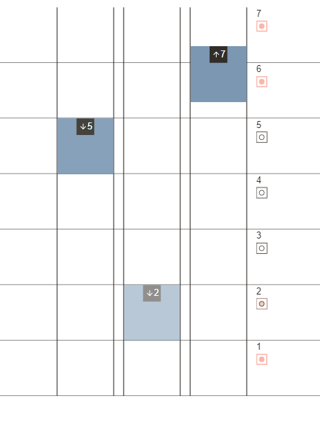

# TRUECONF-TEST-TASK

Test task for TrueConf.
An elevator system with a call queue that remembers all calls and persists between page renderings.
You cannot call an elevator from a floor if elevator is already there or has already been called to this floor.
Elevator should wait 3 seconds after arriving at the floor, then it can move to different floor if there is a call in queue. Also, only closest idle elevator should respond to the call. Elevators move 1 floor per second.



## Technology Stack

- [TypeScript](https://github.com/microsoft/TypeScript) - main language of the project
- [Vite](https://github.com/vitejs/vite) - build tool
- [Vue](https://github.com/vuejs/core) - library to build SPA user interface (v3 Composition Api)
- [Pinia](https://github.com/vuejs/pinia) - state managment solution

## Install / Local Set Up

### With npm

```sh
npm install
npm run start
```

### With Docker

#### Create image:

```sh
docker build -t trueconf-test-task .
```

#### Run container for Unix:

```sh
docker run -v $(pwd):/app -d -p 3000:3000 --name trueconf-elevator-app trueconf-test-task
```

If this doesn't work try manually change `$(pwd)` part to your local path to project folder.

#### Run container for Windows

```sh
docker run -e CHOKIDAR_USEPOLLING=true -v %cd%\:/app -d -p 3000:3000 --name trueconf-elevator-app trueconf-test-task
```

If this doesn't work try manually change `%cd%\` part to your local path to project folder.

## Change app config

Config is located in `src/app.config.ts` file. You can change number of elevator shafts, floors, etc. After tweaking config file page reload required.
